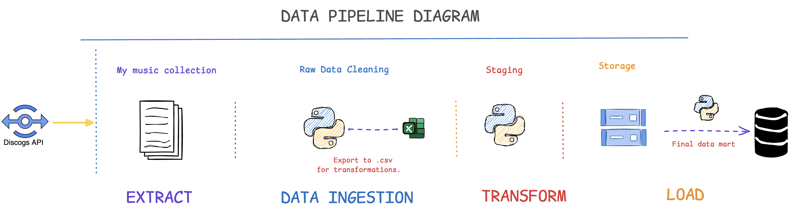

# About this project

I've used the Discogs API that is available for free to export my music collection that I've stored on the Discogs website. This is the initial step for using my collection data for joining with other data, such as from the same API, and get the discography of the artists I'm interested in, and monitor future releases.

## Extraction and Data Ingestion

Firstly, the data is extracted but because they are in the format of dictionaries within lists, a lot of steps had to be taken prior to the Transform stage. The extraction phase was also used to create new features, such as the record labels, artist names, and genres. 
The final dataset, is exported into .csv for the transformation phase.

## Transformation

The first step of the transformation stage, is because as most of the data have been extracted in a text format, a lot of the special characters, or bad wording had to be transformed and removed. 

Secondly, because some of the titles are not in English, the Python library of Google Translator was used to translate from their original language into English.

## Loading the data

Finally, as the data is being saved locally on my disk, I've used the Big Query client to:
1. Upload to a bucket on cloud storage.
2. Create the data schema, and create a data table from the file saved on the bucket.

